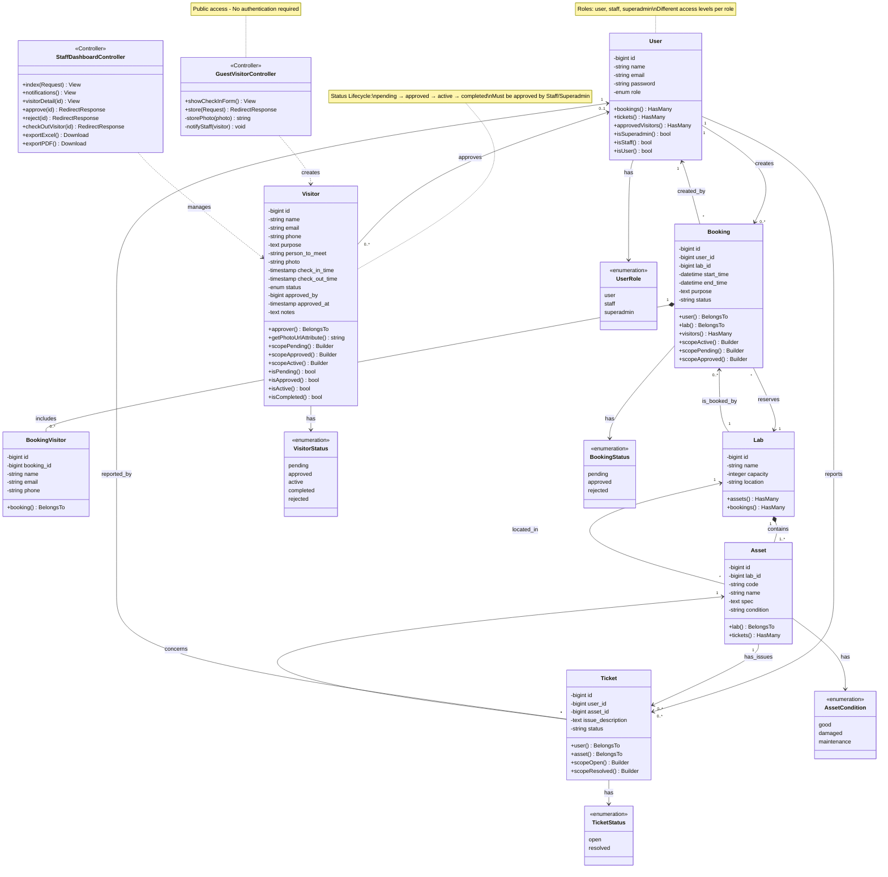
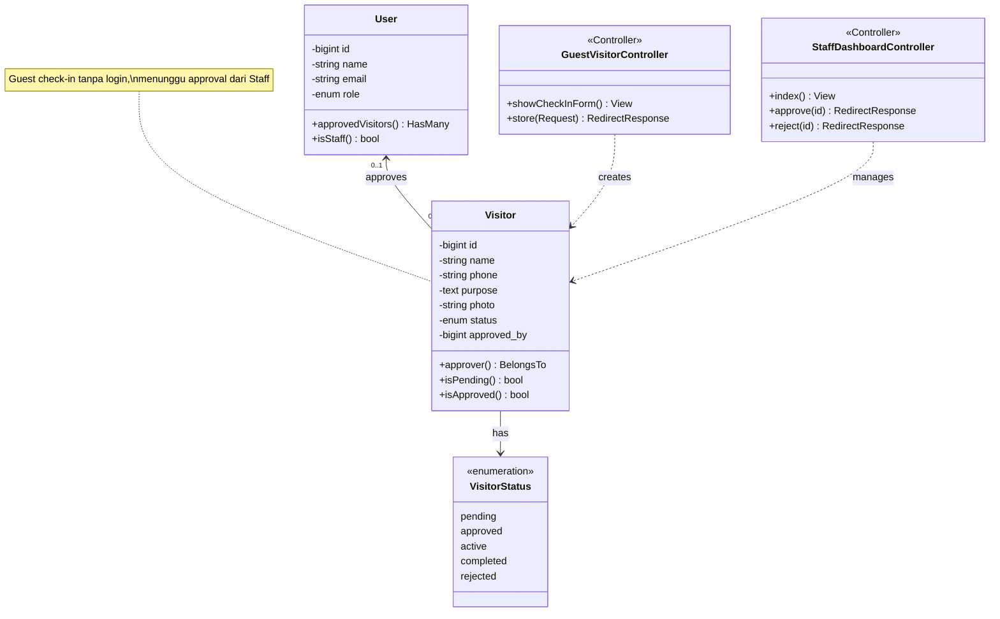
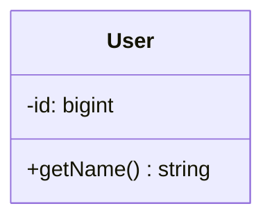

# Class Diagram - Mermaid Format (Karya Ilmiah)

> **Sistem:** SIM-LAB - Guest Visitor Management  
> **Dibuat mengikuti:** 6 Langkah Pembuatan Class Diagram  
> **Format:** Mermaid.js - Compatible with GitHub, GitLab, Notion, Obsidian

---

## 📊 Class Diagram Lengkap



---

## 📐 Versi Minimal (Fokus Visitor Management)

Jika diagram terlalu kompleks untuk laporan, gunakan versi minimal ini:



---

## 🎨 Cara Menggunakan

### **1. GitHub Markdown**
Copy code mermaid ke dalam file `.md`:

````markdown

````

### **2. Mermaid Live Editor**
1. Buka https://mermaid.live/
2. Paste code
3. Export ke PNG/SVG

### **3. VS Code**
1. Install extension "Markdown Preview Mermaid Support"
2. Preview file `.md`

### **4. Notion/Obsidian**
Paste dalam code block dengan language `mermaid`

---

## 📖 Penjelasan Notasi Mermaid

| Notasi | Arti UML | Contoh |
|--------|----------|--------|
| `-->` | Association | `User --> Booking` |
| `*--` | Composition | `Lab *-- Asset` |
| `o--` | Aggregation | `Department o-- Employee` |
| `<\|--` | Inheritance | `Staff <\|-- User` |
| `..\|>` | Realization | `User ..\|> Authenticatable` |
| `..>` | Dependency | `Controller ..> Model` |

---

## 📋 Multiplicity dalam Mermaid

```mermaid
User "1" --> "0..*" Booking
     ↑              ↑
   sisi A        sisi B
```

Format: `ClassA "multiplicity_A" --> "multiplicity_B" ClassB : label`

---

## 💾 Export untuk Laporan

### **Format PNG (300 DPI):**
1. Buka Mermaid Live Editor
2. Paste code
3. Click "PNG" → Download
4. Gunakan dalam Word/LaTeX

### **Format SVG (Vector):**
- Click "SVG" → Download
- Cocok untuk scaling tanpa blur

### **Format PDF:**
- Export SVG → Convert to PDF
- Atau screenshot dengan resolusi tinggi

---

## 📝 Caption untuk Laporan

**Bahasa Indonesia:**
```
Gambar 3.1 Class Diagram Sistem Guest Visitor Management
```

**Bahasa Inggris:**
```
Figure 3.1 Class Diagram of Guest Visitor Management System
```

---

## ✅ Checklist Kualitas

- [x] Step 1: Class teridentifikasi (Models, Controllers, Enums)
- [x] Step 2: Attributes lengkap dengan tipe data
- [x] Step 3: Methods public yang meaningful
- [x] Step 4: Relationships defined (association, composition, dependency)
- [x] Step 5: Multiplicity tercantum pada setiap relasi
- [x] Step 6: Layout terorganisir (grouping by type)
- [x] Visibility modifiers benar (+, -, #)
- [x] Stereotypes untuk Controller dan Enum
- [x] Notes menjelaskan business rules
- [x] Consistent naming convention

---

## 🎓 Untuk Karya Ilmiah

**Yang Harus Ada:**
1. ✅ Judul/Caption
2. ✅ Nomor gambar (Gambar X.X)
3. ✅ Sumber (jika dari referensi)
4. ✅ Penjelasan dalam teks BAB III
5. ✅ Resolusi tinggi (300 DPI untuk print)

**Tips:**
- Gunakan **versi minimal** jika diagram terlalu kompleks
- Fokus pada **modul yang dibahas** (Visitor Management)
- Tambahkan **notes** untuk menjelaskan lifecycle/rules
- **Referensikan** dalam teks: "seperti ditunjukkan pada Gambar 3.1..."

---

**Diagram ini sudah mengikuti 6 langkah pembuatan dan standar UML untuk karya ilmiah! 🎯**
